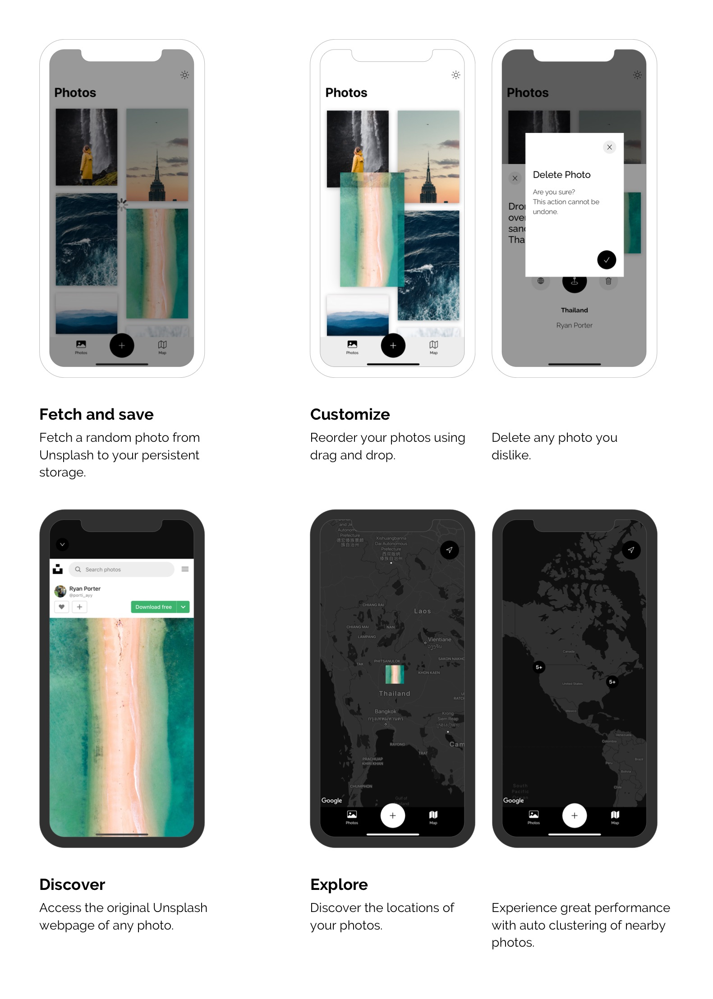

# UnsplashMap

## About the app

UnsplashMap is a simple app that lets you fetch random photos from Unsplash and explore their locations on a map. 

I have created the app to further consolidate my knowledge in UIKit. I was also looking forward to working with maps and making API calls. As always, it was an interesting journey and lots of fun!

## An Overview

## Challenges I faced 

1. The first challenge I faced was to only fetch photos with location data, as I want every photo to be visible on the map. Unfourtunately it is not possible to specify the location pamameter inside the API URL. 

    I have solved this problem by synchronously making additional API calls, as long as the retrieved photo has no location data. Fortunately, it is possible to fetch several random photos on a single request. This leads to an estimated 1.15 expected requests each time, if we assume that every third photo has location data and we fetch five photos on each request. 

2. Also challenging for me was to cluster all nearby photo markers on the map, in order to enhance performance and visibility. I found the documentation to be quite shallow so it took me some time to absorb all the necessary information from several resources.

## Things I learned

- More familiarity with UIKit
- Synchronizing API calls using `DispatchSemephore`/`DispatchGroup`   
- Parsing JSON response with `JSONSerialization` to save into `CoreData` database
- Using the `NSFetchedResultsController`
- WaterFall `UICollectionView` layout and custom animations with the help of CocoaPods libraries
- Making reusable custom Popups and MiniSheets with both `UITapGestureRecognizer` and `UIPanGestureRecognizer` 
- Working with Google Maps SDK, custom MapStyles as well as Markers and Clustering
- Working with `LocationManager` and properly managing the authentication part

## Technologies Used

- Swift
- UIKit without storyboard
- CoreData
- Xcode
- GoogleMaps SDK
- CocoaPods
- Sketch
- Miro
- Adobe Photoshop 

## Additionals

**Design prototypes in Sketch**

**Data architecture diagram**

**Object diagram of CoreData entities**

**Unsplash API**

https://unsplash.com/documentation#get-a-random-photo

https://unsplash.com/api-terms

## More

Feel free to checkout my website https://www.kaizheng.de/.
